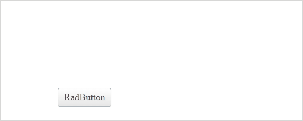
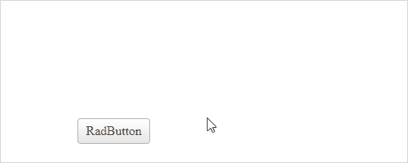

# Button Confirm Dialog

Built-in functionality used to show confirmation pop-up/dialog asking for confirmation from the user for the next actions, whether a client-script is to be executed or a Post back to be done. As of R2 2019, all button types except the **RadRadioButtonList** and **RadCheckboxList** come with built-in *Confirmation Dialog* and you can enable it simply by defining a text for the **ConfirmText** property.

### Settings/Properties

* **ConfirmText**: Enables the Confirm Dialog functionality and sets the confirmation message
* **UseRadConfirm**: Switches between RadConfirm and window.confirm() dialog mode. Default value: true

### Settings to customize the RadConfirm dialog window

* **Title**: Sets the title of the dialog window
* **Height**: Sets the dialog height
* **Width**: Sets the dialog width

## Examples

Enable the Confirm Dialog by defining a value for the **ConfirmText** property

````ASP.NET
<telerik:RadButton runat="server" ID="RadButton1" Text="RadButton">
    <ConfirmSettings ConfirmText="Are you sure you want to continue?" />
</telerik:RadButton>
````

DEMO using **window.confirm()**



Use RadConfirm for the Confirm Dialog

>note Since the default value of the `UseRadConfirm` property is `True`, and so if **RadWindowManager** is present on the page, RadConfirm will be used as the Confirm Dialog.

In addition to the RadButton, add a RadWindowManager on the page as well.

````ASP.NET
<telerik:RadButton runat="server" ID="RadButton1" Text="RadButton">
    <ConfirmSettings ConfirmText="Are you sure you want to continue?"  />
</telerik:RadButton>

<telerik:RadWindowManager ID="RadWindowManager1" runat="server"></telerik:RadWindowManager>
````

DEMO using **RadConfirm**



## Different Button Types

**RadCheckBox**

````ASP.NET
<telerik:RadCheckBox ID="RadCheckBox1" runat="server" Text="RadCheckBox">
    <ConfirmSettings ConfirmText="Are you sure you want to continue?" />
</telerik:RadCheckBox>
````
**RadPushButton**

````ASP.NET
<telerik:RadPushButton ID="RadPushButton1" runat="server" Text="RadPushButton1">
    <ConfirmSettings ConfirmText="Are you sure you want to continue?" />
</telerik:RadPushButton>
````

**RadLinkButton**

````ASP.NET
<telerik:RadLinkButton ID="RadLinkButton1" runat="server" Text="RadLinkButton1" NavigateUrl="https://demos.telerik.com/aspnet-ajax/button" Target="_blank">
    <ConfirmSettings ConfirmText="Are you sure you want to continue?" />
</telerik:RadLinkButton>
````

**RadToggleButton**

````ASP.NET
<telerik:RadToggleButton runat="server" ID="RadToggleButton1">
    <ConfirmSettings ConfirmText="Are you sure you want to continue?" />
    <ToggleStates>
        <telerik:ButtonToggleState Text="RadToggleButton1 - First Toggle"></telerik:ButtonToggleState>
        <telerik:ButtonToggleState Text="RadToggleButton1 - Second Toggle"></telerik:ButtonToggleState>
    </ToggleStates>
</telerik:RadToggleButton>
````

**RadImageButton**

````ASP.NET
<telerik:RadImageButton ID="RadImageButton1" runat="server" Text="RadImageButton1" Width="230px" Height="230px">
    <ConfirmSettings ConfirmText="Are you sure you want to continue?" />
    <Image Url="https://demos.telerik.com/aspnet-ajax/editor/images/top_image.png" />
</telerik:RadImageButton>
````

## See Also

 * [Button - Confirm Postback](https://demos.telerik.com/aspnet-ajax/button/examples/confirm/defaultcs.aspx)
 * [Window - Confirm Dialog Integration](https://demos.telerik.com/aspnet-ajax/window/examples/confirmserverclicks/defaultcs.aspx)
